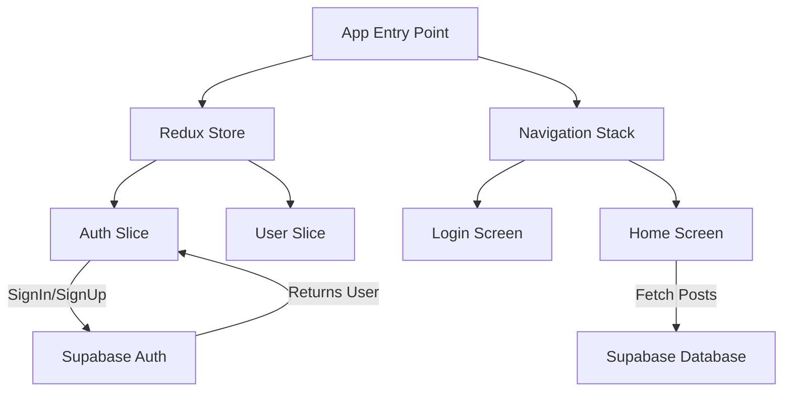

# Talkr - Social Media App

Talkr is a social media application similar to Twitter, built using **React Native, TypeScript, and Supabase**. It provides authentication, state management, and other core features following the **MVVM architecture**.

## 🚀 Features
- User authentication (Sign In, Sign Up, Sign Out)
- State management using Redux
- Supabase backend integration
- Email/password authentication
- Environment variable management with `react-native-dotenv`
- Core MVVM architecture pattern

---

## 📌 Project Structure

---

## 🛠️ Installation & Setup

### **1️⃣ Clone the Repository**
```sh
git clone https://github.com/henrydykee/talkr.git
cd talkr
```

### **2️⃣ Install Dependencies**
```sh
yarn install  # or npm install
```

### **3️⃣ Setup Environment Variables**
Create a `.env` file in the root directory and add your Supabase credentials:

```ini
SUPABASE_URL="your_supabase_url"
SUPABASE_ANON_KEY="your_supabase_anon_key"
```

### **4️⃣ Link React Native Dependencies**
```sh
yarn react-native link
```

### **5️⃣ Start the Metro Bundler**
```sh
yarn start --reset-cache
```

### **6️⃣ Run on Emulator or Device**
For **Android**:
```sh
yarn android
```
For **iOS**:
```sh
cd ios && pod install && cd ..
yarn ios
```

---

## 📂 Folder Structure
```
📦 talkr
 ┣ 📂 app
 ┃ ┣ 📂 core
 ┃ ┃ ┣ 📂 managers
 ┃ ┃ ┃ ┗ 📜 supabase.ts
 ┃ ┃ ┣ 📂 config
 ┃ ┃ ┃ ┗ 📜 env.ts
 ┃ ┣ 📂 screens
 ┃ ┃ ┣ 📜 LoginScreen.tsx
 ┃ ┃ ┣ 📜 HomeScreen.tsx
 ┃ ┣ 📂 redux
 ┃ ┃ ┣ 📜 store.ts
 ┃ ┃ ┣ 📜 authSlice.ts
 ┣ 📜 .env
 ┣ 📜 babel.config.js
 ┣ 📜 package.json
 ┣ 📜 README.md
```

---

## 🔧 Troubleshooting
### Issue: Unable to resolve `@env`
- Ensure `react-native-dotenv` is installed:
  ```sh
  yarn add react-native-dotenv
  ```
- Update `babel.config.js`:
  ```js
  module.exports = {
    presets: ['module:metro-react-native-babel-preset'],
    plugins: [['module:react-native-dotenv']],
  };
  ```
- Restart the Metro bundler:
  ```sh
  yarn start --reset-cache
  ```

---

## 📜 License
MIT License

